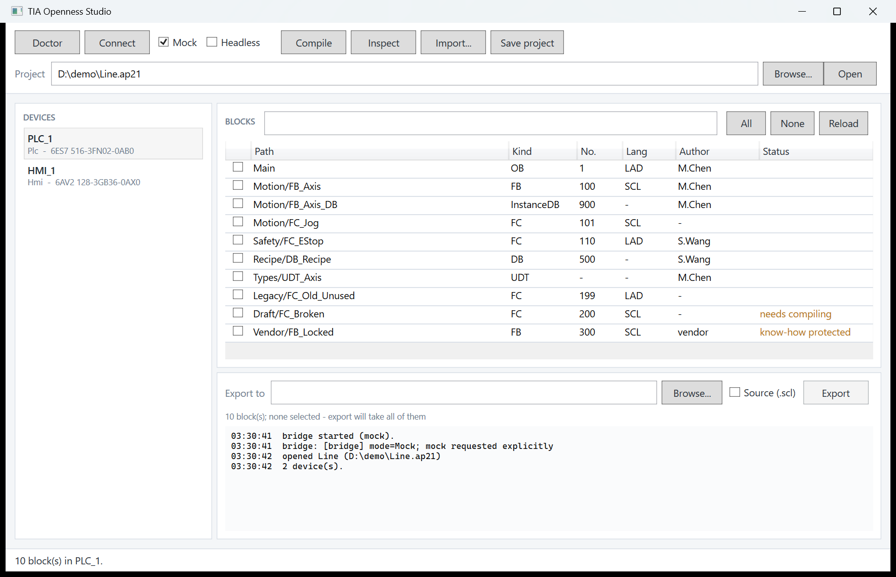

# TIA Openness Studio

Drive Siemens TIA Portal (V15.1 – V21) from a desktop app, a command line, or an AI assistant.

Three front ends share one engine:

| front end | project | what it is for |
|---|---|---|
| **Desktop** | `TiaOpenness.Studio.exe` | Point-and-click: browse the project, batch export/import, compile, inspect, version control |
| **CLI** | `tia.exe` | Scripts and CI. Same operations, exit codes 0/1/2 |
| **MCP server** | `TiaOpenness.Mcp.exe` | Lets Claude / Cursor / VS Code operate TIA Portal in natural language |



---

## Why it is built this way

The Openness assemblies are **.NET Framework 4.8, x64 only**, are not redistributable (even
Siemens' own NuGet package resolves them from the local install), and must be loaded from the
TIA Portal directory through an `AssemblyResolve` hook. Modern .NET cannot load them.

V21 also changed the layout: the single `Siemens.Engineering.dll` became
`Siemens.Engineering.Base.dll` + `.Step7.dll` + others under a `net48` subfolder, re-signed with
a new public key token. Discovery handles both layouts and `tia doctor` reports which one it
found; code built against V20 does not run on V21 and vice versa.

So the code that touches Openness lives in its own process:

```
┌──────────────────────────────────────────────────────┐
│  Desktop (WPF, net10.0-windows)                      │
│  CLI (net10.0)     MCP server (net10.0)              │
│         └── TiaOpenness.Client (netstandard2.0) ─────┤
└────────────────────────┬─────────────────────────────┘
                         │  JSON-RPC 2.0, newline-delimited, over stdio
┌────────────────────────▼─────────────────────────────┐
│  TiaOpenness.Bridge  (net48, x64, EXE)               │
│    · binds ONE Openness version per process          │
│    · AssemblyResolve hook, session lifetime          │
├──────────────────────────────────────────────────────┤
│  TiaOpenness.Core (net48)                            │
│    ITiaSession ──┬── OpennessSession (real)          │
│                  └── MockTiaSession (no TIA needed)  │
│    OpennessDoctor · OpennessLocator · InspectionEngine│
└──────────────────────────────────────────────────────┘
```

Consequences worth knowing:

- **A crash or hang in TIA Portal cannot take the UI with it** — kill the bridge, restart it.
- **One bridge = one Openness version.** The CLR caches resolved assemblies per AppDomain, so
  driving V19 and V21 at once means two bridge processes.
- **Everything above `ITiaSession` builds and runs without TIA Portal**, against `MockTiaSession`.
  That is how the desktop app, the CLI and the MCP server were developed and tested here.

---

## Quick start

### Try it without TIA Portal

```bash
dotnet build TiaOpenness.slnx -c Release
```

```bash
src\TiaOpenness.Gui\bin\Release\net10.0-windows\TiaOpenness.Studio.exe --mock
```

The app opens a synthetic project with two devices and ten blocks. Export really writes files;
compile really returns diagnostics. Nothing touches a real project.

### Against a real TIA Portal

1. Install TIA Portal V21 **with the Openness option**.
2. Add your Windows account to the local group and **log off and back on** (a group only takes
   effect in a new logon token):

   ```bash
   net localgroup "Siemens TIA Openness" "%USERDOMAIN%\%USERNAME%" /add
   ```

3. Copy the Siemens assemblies into `lib\` and rebuild:

   ```bash
   powershell -ExecutionPolicy Bypass -File tools\fetch-openness-dlls.ps1
   ```

   ```bash
   dotnet build TiaOpenness.slnx -c Release
   ```

4. Verify the environment before anything else:

   ```bash
   src\TiaOpenness.Cli\bin\Release\net10.0\tia.exe doctor
   ```

   Every failed check prints the exact command that fixes it.

5. Connect **with the UI visible the first time**. TIA Portal shows a one-off trust dialog for
   an unknown application; a headless instance cannot display it and will simply hang.

See [docs/deployment.md](docs/deployment.md) for the full checklist and the errors that come up
in practice.

---

## CLI

```bash
tia doctor
tia devices  --project D:\p\Line.ap21
tia blocks   --project D:\p\Line.ap21 --device PLC_1
tia export   --project D:\p\Line.ap21 --device PLC_1 --out D:\repo\plc --format Source
tia import   --project D:\p\Line.ap21 --device PLC_1 --files new.scl --overwrite --save
tia compile  --project D:\p\Line.ap21 --device PLC_1 --save
tia inspect  --project D:\p\Line.ap21 --device PLC_1 --name-pattern "^(OB|FB|FC|DB|UDT)_"
tia vci status --project D:\p\Line.ap21
```

Add `--mock` to any of them to run against the synthetic project.

Exit codes: `0` success, `1` the operation reported failures, `2` usage or transport error —
so `tia compile` fails a CI build on a compiler error without any extra parsing.

### Putting a PLC program under Git

TIA project files are binary. There are two routes to reviewable text; pick by TIA version.

**V21 — Version Control Interface.** TIA maps the project onto a folder, one text file per
object, and tracks per-object drift. No compile needed to *detect* changes.

```bash
tia vci create --project D:\p\Line.ap21 --name git --folder D:\repo\plc
tia vci map    --project D:\p\Line.ap21 --apply
tia vci push   --project D:\p\Line.ap21 --apply
git -C D:\repo\plc add -A && git -C D:\repo\plc commit -m "PLC_1 snapshot"
```

```bash
tia vci status --project D:\p\Line.ap21     # per-object diff; exits 1 when anything differs
```

Mutating sub-commands are a dry run unless you pass `--apply`. Full details, including the API
rules that shape the design, in [docs/version-control.md](docs/version-control.md).


**V15.1 – V20 — text export.** Coarser, but works everywhere:

```bash
tia compile --project D:\p\Line.ap21 --device PLC_1
tia export  --project D:\p\Line.ap21 --device PLC_1 --out D:\repo\plc --format Source
```

`--format Source` writes `.scl` / `.db` / `.udt` text and mirrors the TIA folder structure.
Two limits are TIA's, not this tool's: **a block must compile before it can be exported**, and
**know-how protected blocks cannot be exported at all**. Both are reported per block rather
than silently skipped.

---

## MCP server

```json
{
  "mcpServers": {
    "tia": {
      "command": "C:\\...\\TiaOpenness.Mcp.exe",
      "args": ["--allow-write"]
    }
  }
}
```

Twelve read tools are always available: `tia_doctor`, `tia_connect`, `tia_open_project`,
`tia_list_devices`, `tia_list_blocks`, `tia_list_tags`, `tia_export_blocks`, `tia_compile`,
`tia_inspect`, `tia_vc_workspaces`, `tia_vc_status`, `tia_vc_push`.

The five that change a project — `tia_import_blocks`, `tia_save_project`,
`tia_vc_create_workspace`, `tia_vc_map`, `tia_vc_pull` — are only registered with
`--allow-write`. Without that flag they are not just refused, they are not visible to the model.
Start without it while you are still learning what the assistant does with your project.

Add `--mock` to point the whole tool surface at the synthetic project.

---

## Repository layout

```
src/
  TiaOpenness.Contracts/   DTOs + JSON-RPC contract         netstandard2.0
  TiaOpenness.Core/        ITiaSession, Doctor, Locator,
                           InspectionEngine, MockTiaSession  net48
  TiaOpenness.Openness/    the real Siemens.Engineering
                           adapter incl. VCI (builds only
                           when lib\ holds the assemblies)   net48 x64
  TiaOpenness.Bridge/      JSON-RPC stdio host               net48 x64 exe
  TiaOpenness.Client/      typed client + process management netstandard2.0
  TiaOpenness.Cli/         tia.exe                           net10.0
  TiaOpenness.Gui/         TiaOpenness.Studio.exe            net10.0-windows
  TiaOpenness.Mcp/         MCP stdio server                  net10.0
lib/                       Siemens assemblies (not in git; V20 or V21 layout)
tools/                     fetch-openness-dlls.ps1
docs/                      deployment, version control, protocol, roadmap
```

## Prior art

The design draws on published work; see [docs/prior-art.md](docs/prior-art.md) for what was
taken from where and the licence position on each.
