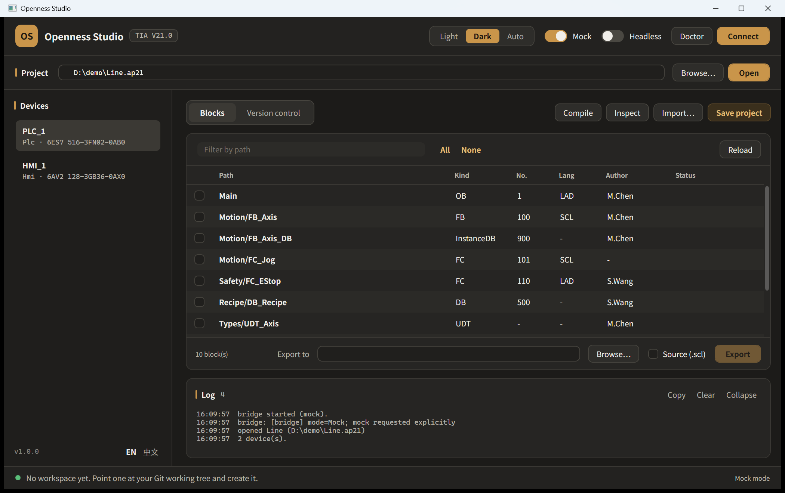

# TIA Openness Studio

Drive Siemens TIA Portal (V15.1 – V21) from a desktop app or an AI assistant.

**One file.** `TiaOpenness.exe` is the whole product — no installer, no unzipping, no .NET to
install first. It is two things depending on how it is started:

| start it as | what you get |
|---|---|
| `TiaOpenness.exe` (or a double-click) | The desktop app: browse the project, batch export/import, compile, inspect, version control |
| `TiaOpenness.exe mcp [--allow-write]` | An MCP server, so Claude / Cursor / VS Code can operate TIA Portal in natural language |

Everything it needs at run time — the bridge, a C# compiler, the Openness adapter's sources — is
carried inside the executable and unpacked on first use. See
[Why it is built this way](#why-it-is-built-this-way) for why those three cannot simply be linked in.


---

## Why it is built this way

The Openness assemblies are **.NET Framework 4.8, x64 only**, are not redistributable (even
Siemens' own NuGet package resolves them from the local install), and must be loaded from the
TIA Portal directory through an `AssemblyResolve` hook. Modern .NET cannot load them.

V21 also changed the layout: the single `Siemens.Engineering.dll` became
`Siemens.Engineering.Base.dll` + `.Step7.dll` + others under a `net48` subfolder, re-signed with
a new public key token. Discovery handles both layouts and the app's Doctor reports which one it
found; code built against V20 does not run on V21 and vice versa.

So the code that touches Openness lives in its own process — inside the same file, unpacked when
it is first needed:

```
  TiaOpenness.exe  (net10.0-windows, self-contained, single file)
┌──────────────────────────────────────────────────────┐
│  Desktop (WPF)          MCP server                   │
│         └── TiaOpenness.Client ──────────────────────┤
│                                                      │
│  embedded payload, unpacked on first run:            │
│    payload/bridge    payload/compiler   payload/adapter
└────────────────────────┬─────────────────────────────┘
                         │  JSON-RPC 2.0, newline-delimited, over stdio
┌────────────────────────▼─────────────────────────────┐
│  TiaOpenness.Bridge  (net48, x64, EXE)               │
│    · binds ONE Openness version per process          │
│    · AssemblyResolve hook, session lifetime          │
│    · builds the adapter on request                   │
├──────────────────────────────────────────────────────┤
│  TiaOpenness.Core (net48)                            │
│    ITiaSession ──┬── OpennessSession (real)          │
│                  └── MockTiaSession (no TIA needed)  │
│    OpennessDoctor · OpennessLocator · InspectionEngine│
└──────────────────────────────────────────────────────┘
```

Three things have to be files rather than code linked into the exe, and all three ship inside it:

| | why it cannot just be linked in |
|---|---|
| **the bridge** | a .NET Framework 4.8 process, because the Siemens assemblies are .NET Framework only and .NET 10 cannot load them |
| **the adapter** | ships as *sources*: it must be compiled against assemblies Siemens does not permit redistributing |
| **a C# compiler** | so the machine with TIA Portal can build that adapter without a .NET SDK |

Consequences worth knowing:

- **A crash or hang in TIA Portal cannot take the UI with it** — kill the bridge, restart it.
- **One bridge = one Openness version.** The CLR caches resolved assemblies per AppDomain, so
  driving V19 and V21 at once means two bridge processes.
- **Everything above `ITiaSession` builds and runs without TIA Portal**, against `MockTiaSession`.
  That is how the desktop app and the MCP server were developed and tested here.

---

## Quick start

### Try it without TIA Portal

Download the [latest release](https://github.com/asckye/tia-openness-studio/releases/latest) and run:

```bash
TiaOpenness.exe --mock
```

The app opens a synthetic project with two devices and ten blocks. Export really writes files;
compile really returns diagnostics. Nothing touches a real project.

From a source checkout instead:

```bash
dotnet build TiaOpenness.slnx -c Release
```

```bash
src\TiaOpenness.Gui\bin\Release\net10.0-windows\TiaOpenness.exe --mock
```

The desktop app ships in **English and Chinese**, in a **light and a dark appearance** (plus
*auto*, which tracks the Windows setting). Both are switched live - the language from the foot of
the sidebar, the appearance from the header - and remembered between runs. For a demo or a
screenshot they can be pinned from the command line without touching the saved preference:

```bash
TiaOpenness.exe --mock --lang zh --theme dark
```



One amber accent carries the whole interface, and it is rationed so it keeps meaning something:
a filled amber button is the one action a row exists for, soft amber is an important action that
is not that row's purpose, and everything else is outlined or a plain link. Paths, versions and
counts are set in a monospace face so a backslash or an underscore is never ambiguous.

### Against a real TIA Portal

On the machine that has TIA Portal:

1. Install TIA Portal **with the Openness option**.
2. Add your Windows account to the local group and **log off and back on** — a group only takes
   effect in a new logon token, and this is the step people miss:

   ```bash
   net localgroup "Siemens TIA Openness" "%USERDOMAIN%\%USERNAME%" /add
   ```

3. Run `TiaOpenness.exe` and press **Enable Openness** in the header. Once.
4. Press **Doctor** to check the rest. Every failed check prints the command that fixes it.
5. Press **Connect** — **with the TIA window visible the first time**. TIA Portal shows a one-off
   trust dialog for an unknown application; a headless instance cannot display it and just hangs.

Step 3 is the one thing that cannot be done for you. `TiaOpenness.Openness.dll` has to be compiled
against the `Siemens.Engineering` assemblies, and Siemens does not permit redistributing them, so
no build machine without TIA Portal — including this project's CI — can produce it. The executable
therefore carries the adapter's sources and a C# compiler and builds it in place: **no .NET SDK,
no Visual Studio, no source clone, and no restart afterwards**.

Because it compiles the real typed adapter against the real assemblies, an API your TIA version
does not have becomes a compile error naming a file and line, rather than an obscure failure at
run time later.

See [docs/deployment.md](docs/deployment.md) for the full checklist and the errors that come up
in practice.

---

## Putting a PLC program under Git

TIA project files are binary. There are two routes to reviewable text; pick by TIA version.
Both live in the desktop app.

**V21 — Version Control Interface**, on the *Version control* tab. TIA maps the project onto a
folder, one text file per object, and tracks per-object drift. No compile is needed to *detect*
changes, and the tab names exactly which blocks differ before you commit.


Point a workspace at your Git working tree, press **Map project**, then **Push**, and commit:

```bash
git -C D:\repo\plc add -A && git -C D:\repo\plc commit -m "PLC_1 snapshot"
```

Every action that changes something is a **dry run** until you clear that checkbox — mapping
writes into the project, and *Pull* overwrites blocks in it. Full details, including the API rules
that shape the design, in [docs/version-control.md](docs/version-control.md).

**V15.1 – V20 — text export**, on the *Blocks* tab. Coarser, but works everywhere: tick
**Source (.scl)**, choose a folder, press **Export**. It writes `.scl` / `.db` / `.udt` text and
mirrors the TIA folder structure.

Two limits there are TIA's, not this tool's: **a block must compile before it can be exported**,
and **know-how protected blocks cannot be exported at all**. Both are reported per block rather
than silently skipped.

---

## MCP server

```json
{
  "mcpServers": {
    "tia": {
      "command": "C:\\...\\TiaOpenness.exe",
      "args": ["mcp", "--allow-write"]
    }
  }
}
```

Twelve read tools are always available: `tia_doctor`, `tia_connect`, `tia_open_project`,
`tia_list_devices`, `tia_list_blocks`, `tia_list_tags`, `tia_export_blocks`, `tia_compile`,
`tia_inspect`, `tia_vc_workspaces`, `tia_vc_status`, `tia_vc_push`.

The five that change a project — `tia_import_blocks`, `tia_save_project`,
`tia_vc_create_workspace`, `tia_vc_map`, `tia_vc_pull` — are only registered with
`--allow-write`. Without that flag they are not just refused, they are not visible to the model.
Start without it while you are still learning what the assistant does with your project.

Add `--mock` to point the whole tool surface at the synthetic project.

---

## Repository layout

```
src/
  TiaOpenness.Contracts/   DTOs + JSON-RPC contract         netstandard2.0
  TiaOpenness.Core/        ITiaSession, Doctor, Locator,
                           InspectionEngine, MockTiaSession  net48
  TiaOpenness.Openness/    the real Siemens.Engineering
                           adapter incl. VCI (builds only
                           when lib\ holds the assemblies)   net48 x64
  TiaOpenness.Bridge/      JSON-RPC stdio host, adapter
                           builder                           net48 x64 exe
  TiaOpenness.Client/      typed client, process management,
                           embedded-payload unpacking        netstandard2.0
  TiaOpenness.Gui/         TiaOpenness.exe - the product      net10.0-windows
    Program.cs             the one entry point: desktop, or `mcp`
    Themes/                light/dark palettes, control templates, type ramp
    Localization/          the EN/ZH string catalogue and the {l:Tr} markup extension
  TiaOpenness.Mcp/         MCP stdio server (library)        net10.0
tests/
  TiaOpenness.Core.Tests/  inspection rules, mock session,
                           doctor report                      net48
  TiaOpenness.Gui.Tests/   catalogue parity, theme tokens,
                           live language switch, main-window
                           smoke render                       net10.0-windows
lib/                       Siemens assemblies (not in git; V20 or V21 layout)
tools/                     fetch-openness-dlls.ps1 (source builds only)
docs/                      deployment, version control, protocol, roadmap
```

Application code lives under `src/`, tests under `tests/`; nothing in `src/` references a test
framework. The two trees are separate solution folders in `TiaOpenness.slnx`.

## Releases

Every push is built and tested on a Windows runner, and the packaged binaries are attached to the
run as an artifact, so any branch can be tried without a local toolchain.

A release is cut by pushing a version tag. The workflow builds, runs the whole suite, packages,
and publishes the executable and its checksum to a GitHub release:

```bash
git tag -a v2.0.0 -m "..." && git push origin v2.0.0
```

The version lives in one place, `<Version>` in `Directory.Build.props`. The release job refuses to
run if the tag disagrees with it, because an artifact whose name contradicts the version inside it
is worse than no artifact. To build the same thing locally:

```bash
powershell -ExecutionPolicy Bypass -File build\publish.ps1
```

That writes one file, `artifacts\TiaOpenness-v<version>-win-x64.exe`, and refuses to finish if the
publish left anything beside it — the point of the artifact is that it is complete on its own.

Before publishing, CI copies that executable into an empty folder and drives it over MCP until it
returns a device from the mock project. That is the check that matters: it proves the embedded
bridge, compiler and adapter sources all survived the single-file publish and unpacked correctly.
A payload that is broken looks perfectly fine until someone runs it.

## Tests

```bash
dotnet test TiaOpenness.slnx -c Release
```

Nothing in the suite needs TIA Portal. The Core tests run the inspection rules and the mock
session on .NET Framework 4.8, the same runtime the bridge uses. The GUI tests build the real
main window on a WPF thread and render it, which is what catches a resource key that resolves to
the wrong type or a template that quietly binds to nothing; they also scan the UI's own source to
prove every `{l:Tr …}` key and every `{DynamicResource …}` it names actually exists, and that
the English and Chinese catalogues use the same `{0}` placeholders.

## Prior art

The design draws on published work; see [docs/prior-art.md](docs/prior-art.md) for what was
taken from where and the licence position on each.
