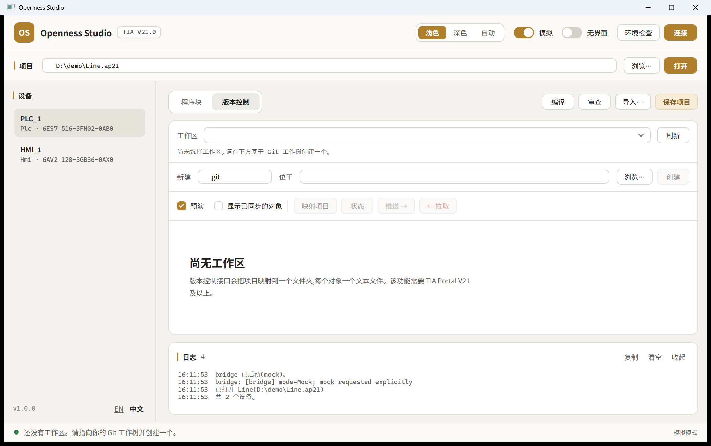

# Putting a TIA project under Git

A TIA project file is binary, so Git can store it but cannot diff, merge or review it. That is
why "version control" in this field has so often meant a folder of dated *Save As* copies.

TIA Portal V21's **Version Control Interface** (VCI) fixes it. A *workspace* is an ordinary
folder holding one text file per mapped object. Point it at a Git working tree and the project
becomes reviewable.

## Two ways to get text out, and when to use which

|  | Export as source | Version control (V21+) |
|---|---|---|
| TIA version | V15.1+ | **V21+ only** |
| Where | *Blocks* tab, tick **Source (.scl)** | *Version control* tab |
| Must compile first | **yes** — TIA refuses to export an inconsistent block | no, for change *detection* |
| Granularity | per block, one file each | per mapped object |
| Knows what changed | no — diff the files afterwards | **yes** — per-object compare state |
| Restore back into the project | manual import | **Pull**, one action |
| Know-how protected blocks | fail | reported as unsupported |

Use VCI when you have V21. Use the source export when you do not, or when you want a plain
snapshot without adding configuration to the project.

## The loop



1. **Create a workspace** over an existing folder — normally your Git working tree. Type a name
   and the folder, press **Create**.
2. **Map project** — walks the project and maps everything VCI can handle, in one action. Coarse
   first: a device that can be mapped as a unit is not split into blocks.
3. **Push** — writes the project out as text.
4. Commit, from that folder:

   ```bash
   git -C D:\repo\plc add -A && git -C D:\repo\plc commit -m "PLC_1 snapshot"
   ```

Later, to see what an engineer changed, press **Status**:

```
Unequal     PLC_1/Motion/FB_Axis
Unequal     PLC_1/Safety/FC_EStop

11 mapped object(s), 2 differ.
```

To bring a reviewed version back into the project after a `git pull`, press **Pull**. Then
compile and save — a pull leaves the restored blocks inconsistent, exactly as the TIA UI would.

## Safety

**Dry run is ticked by default.** Nothing mapping, pushing or pulling does takes effect until you
clear it, and the app reports what *would* happen first.

- **Map** and **Create** write configuration **into the TIA project**.
- **Pull** **overwrites blocks in the open project** and cannot be undone. It also asks for
  confirmation before it runs for real.
- **Push** only writes files on disk; the project is untouched.

In the MCP server the split is by tier: `tia_vc_workspaces`, `tia_vc_status` and `tia_vc_push`
are always available; `tia_vc_create_workspace`, `tia_vc_map` and `tia_vc_pull` appear only with
`--allow-write`, and each defaults to `dryRun: true`.

## Unattended

Over MCP, or by driving the bridge's JSON-RPC directly (see [protocol.md](protocol.md)):

```bash
TiaOpenness.exe mcp --allow-write
```

`vc.status` returns `Differing`, so a pipeline can fail when someone changed the project without
committing.

## Things the API enforces, that surprised us

These are TIA's rules, discovered by running against V21 — the code works with them rather than
around them:

- **An object already in sync cannot be synchronized.** TIA answers "Synchronize cannot be
  called on a workspace mapping that has a compare status of equal". So "force everything" is
  not an option that exists; equal objects are always skipped and counted separately.
- **Mapping is `ExportObject`, not `ConnectObject`.** Despite the names, `ExportObject` writes
  the file *and* creates the mapping. `ConnectObject` only binds to files that already exist.
- **Sub-folders inside a workspace can be refused** ("Relative Directory Path is Invalid") on
  some builds. The mapper tries a sub-folder first and falls back to a flat layout at the
  workspace root, folding the project path into the file name so nothing collides.
- **Openness proxies die with their parent.** The VCI service and every group reached through it
  must stay referenced for as long as the project is open, or objects obtained earlier throw
  "Access to a disposed object of type Workspace". The adapter roots them deliberately and
  re-acquires after any throw.
- **Not everything is mappable.** Know-how protected blocks and hardware configuration are
  outside VCI. They are reported as `unsupported` rather than skipped silently.

## Line endings

Add a `.gitattributes` to the workspace repository so exported text does not churn between
CRLF and LF on different machines:

```gitattributes
*.s7dcl text eol=crlf
*.xml   text eol=crlf
```

## Trying it without TIA Portal

The mock backend implements the whole loop — workspaces point at real folders, mapping writes
real files, and status really compares content — so the Git workflow can be rehearsed anywhere:

```bash
TiaOpenness.exe --mock
```

Open any path, switch to *Version control*, create a workspace over a folder, untick **Dry run**
and press **Map project**. Mock workspaces persist per project path under
`%LOCALAPPDATA%\TiaOpenness\mock-vci`, because real VCI configuration lives inside the project
and survives reopening it. Delete that folder to start over.
